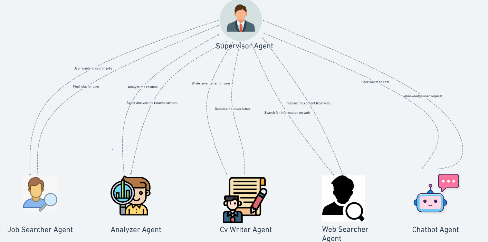

# GenAI Career Assistant: A Multi-Agent Approach



**Author**: [Aman Varyani](https://medium.com/@amanvaryani1910)
**Linkedin**: [Aman Varyani](https://www.linkedin.com/in/aman-varyani-885725181/)

Welcome to the GenAI Career Assistant, a powerful tool designed to revolutionize the job search process using cutting-edge AI technology. This project leverages a multi-agent architecture to provide personalized career guidance, making job hunting more efficient and tailored to individual needs.

## Table of Contents

- [Demo](#demo)
- [Why It's Needed](#why-its-needed)
- [Features](#features)
- [Architecture Overview](#architecture-overview)
- [Key Components](#key-components)
- [Technologies Used](#technologies-used)
- [Installation](#installation)
- [Usage](#usage)
- [Future Improvements](#future-improvements)
- [Contributing](#contributing)
- [License](#license)

## Demo
https://github.com/user-attachments/assets/f1e191ae-19c4-48a0-b24f-dfd59bd9240a


## Why It's Needed

In today's rapidly evolving job market, finding the right job and standing out from the competition can be challenging. The GenAI Career Assistant addresses this by leveraging AI to:

- Tailor job searches to your industry, experience, and location.
- Generate standout cover letters that highlight your strengths.
- Provide detailed insights into potential employers.
- Streamline the job application process through an intelligent, multi-agent system.

## Features

- **Personalized Job Search:** Automatically find job listings that match your criteria.
- **Custom Cover Letters:** Generate cover letters tailored to specific job applications.
- **Company Research:** Gather and present key information about potential employers.
- **Resume Analysis:** Extract and analyze key information from your resume to optimize job matches.
- **Interactive UI:** Easy-to-use interface built with Streamlit for a seamless user experience.

## Architecture Overview

The GenAI Career Assistant is built on a Supervisor Multi-Agent Architecture. Here's how it works:

- **Supervisor:** Manages the overall workflow, deciding which agent to invoke next.
- **JobSearcher:** Handles job search queries and retrieves relevant listings.
- **ResumeAnalyzer:** Extracts and analyzes information from uploaded resumes.
- **CoverLetterGenerator:** Crafts customized cover letters based on resume and job details.
- **WebResearcher:** Performs web searches to gather relevant company information.
- **ChatBot:** Manages general queries and provides conversational responses.

## Key Components

- **Agent Creation and Configuration:** A common function is used to set up agents with specific tools and prompts.
- **Specialized Tools:** Custom tools enhance the agents' capabilities, such as job search tools, resume extractors, and web search tools.
- **Streamlit UI:** The user interface is designed to be intuitive and responsive, facilitating interaction with the assistant.

## Technologies Used

- **LangGraph:** For creating and managing multi-agent workflows.
- **Streamlit:** For building the user interface.
- **OpenAI API:** For leveraging large language models (LLMs).
- **SerperClient and FireCrawlClient:** For web search and scraping capabilities.

## Installation

1. Clone the repository:
   ```bash
   git clone https://github.com/amanv1906/GENAI-CareerAssistant-Multiagent.git
   cd GENAI-CareerAssistant-Multiagent
   ```

2. Install the required packages:
   ```bash
   pip install -r requirements.txt
   ```

3. Set up environment variables by creating a `.streamlit/secrets.toml` file:
   ```toml
   OPENAI_API_KEY = "your-openai-api-key"
   LANGCHAIN_API_KEY = "" # if you want to trace using langsmith"
   LANGCHAIN_TRACING_V2 = "true"
   LANGCHAIN_PROJECT = "JOB_SEARCH_AGENT"
   GROQ_API_KEY = "API key of groq"
   SERPER_API_KEY = "serper API key"
   FIRECRAWL_API_KEY = "firecrawl API key"
   LINKEDIN_JOB_SEARCH = "linkedin_api" # only if you want to use python linkedin-api package
   LINKEDIN_EMAIL = "" # if you have enabled linkedin job search then both password and email are mandatory.
   LINKEDIN_PASS = ""
   ```

4. Run the Streamlit app:
   ```bash
   streamlit run app.py
   ```

## Usage

1. **Upload Your Resume:** Start by uploading your resume in PDF format.
2. **Enter Your Query:** Use the chat interface to ask questions or request specific tasks (e.g., "Find jobs in data science").
3. **Interact with the Assistant:** The assistant will guide you through job searches, resume analysis, and cover letter generation.
4. **Download Results:** Save the generated cover letters or other documents as needed.

## Future Improvements

- **Job Application Integration:** Streamline the application process by integrating directly with job portals.
- **Enhanced User Interface:** Improve the UI/UX with more interactive and dynamic elements.

## Contributing

Contributions are welcome! Please feel free to submit issues, fork the repository, and send pull requests.

## License

This project is licensed under the MIT License. See the [LICENSE](LICENSE) file for details.

---
